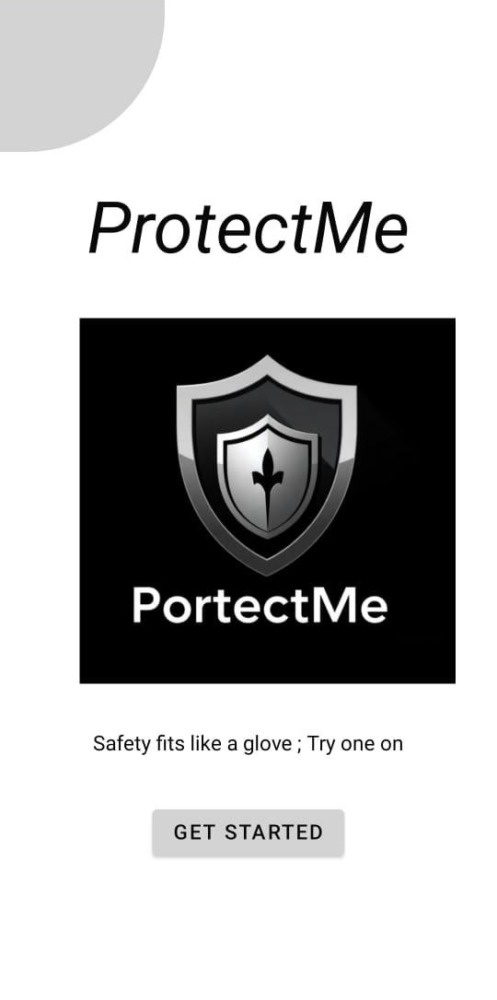
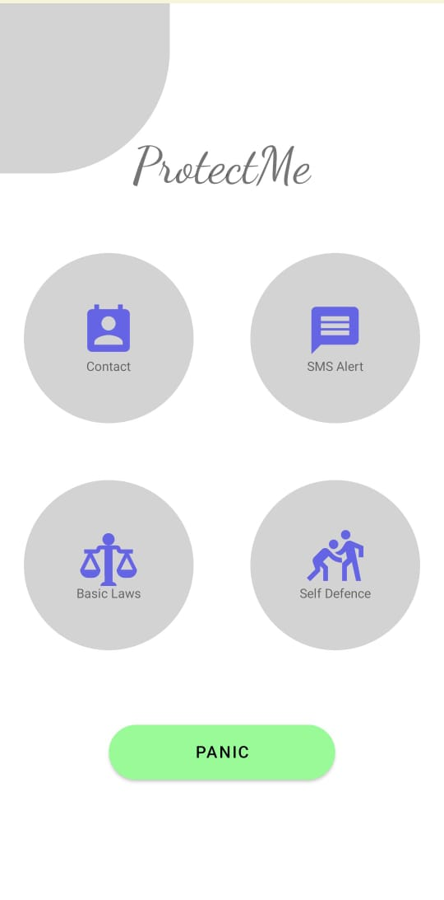

# 📱 ProtectMe - Safety App

An Android app built in Java that lets users **contact help quickly and view their location** on Google Maps.

---

## 🔐 Feel Safe, Always.

ProtectMe is a simple and user-friendly Android app that helps ensure safety and quick communication in emergencies. Built using Android Studio and integrated with Google Maps.

---

## 🛠 Built With

- Java
- Android Studio
- Google Maps SDK
- Gradle
- AndroidX

---

## 🚀 Features

- 📍 Location pin using Google Maps
- 📞 Contact form with emergency number
- ✅ Clean Material Design
- 💬 Realtime interaction (optional with Firebase)

---

## 📸 Screenshots

| Main Screen | Home Screen |
|-------------|-------------|
|  |  |

---

## 📂 Folder Structure

app/
├── manifests/
├── java/
│ └── com.example.yourapp/
│ ├── MainActivity.java
│ └── ContactActivity.java
├── res/
│ ├── layout/
│ │ └── activity_main.xml
│ └── values/
│ └── strings.xml


---

## 📦 How to Run

1. Clone the repo:
   ```bash
   git clone https://github.com/afia0872/ProtectMeA.git


2.Open in Android Studio.

3.Let Gradle sync and finish dependencies.

4.Connect Android device or emulator.

5.Click ▶️ Run.

⚙ Prerequisites
Android Studio (latest)

Java JDK 8+

Android SDK (API 26+)

Optional: Firebase for extra features